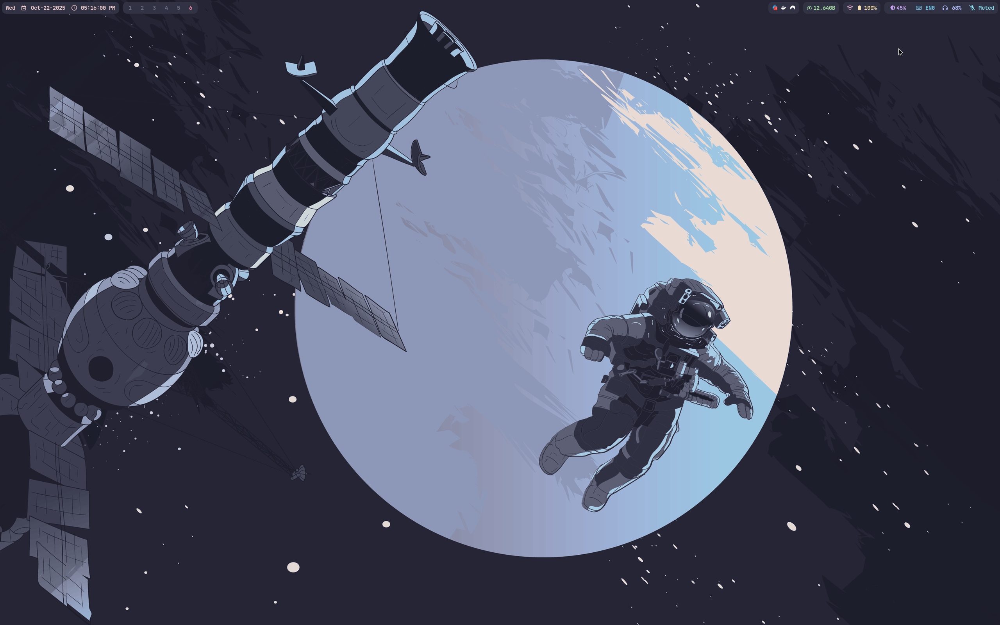
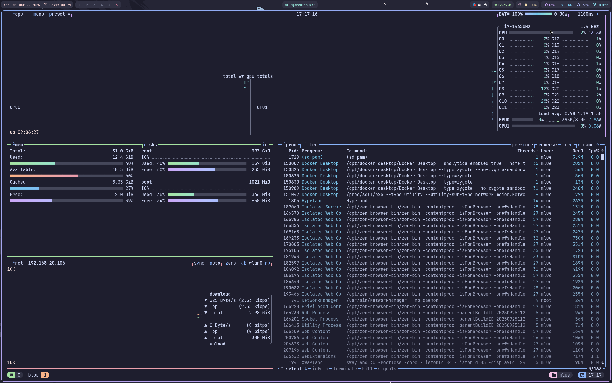
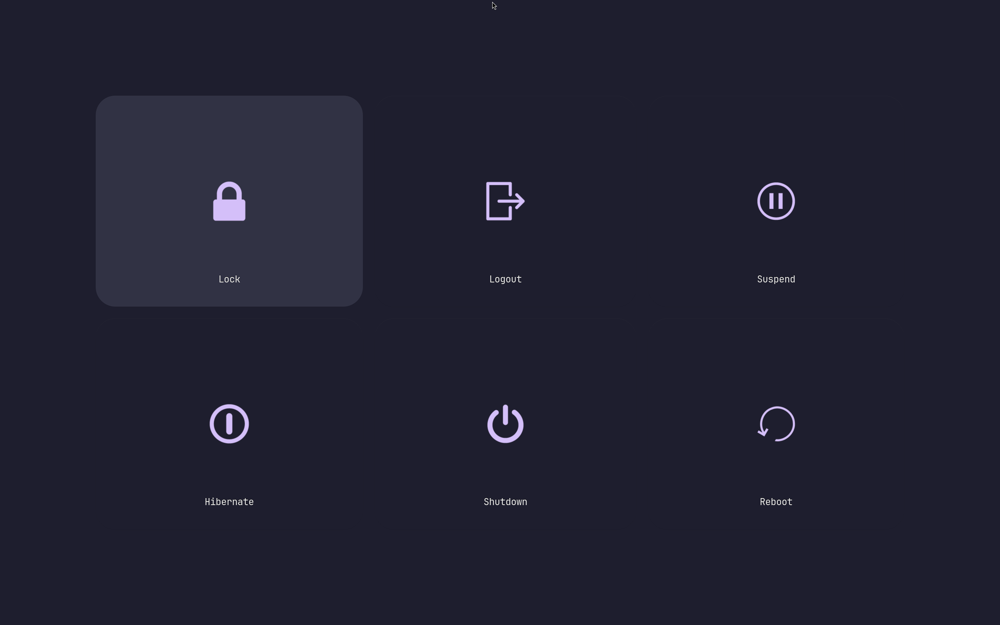
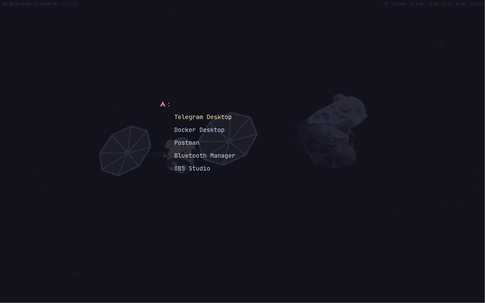
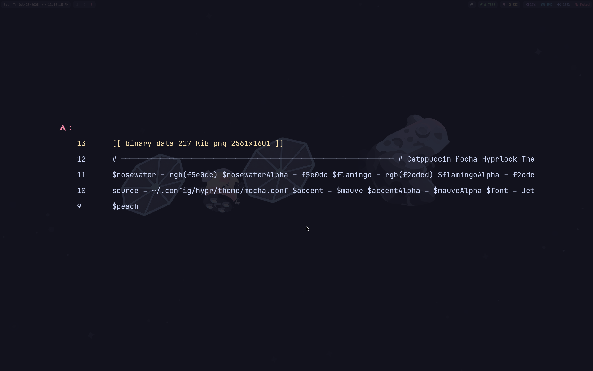
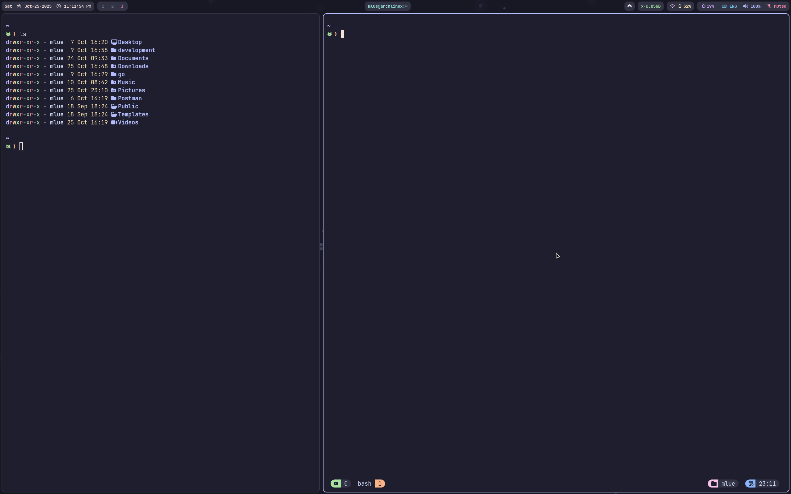

# 🏠 Dotfiles

My personal dotfiles collection for a customized development environment on Arch Linux.

## 📋 Table of Contents
- [Keybindings](#-keybindings)
  - [Applications](#applications)
  - [Window Management](#window-management)
  - [Workspace Navigation](#workspace-navigation)
  - [System Controls](#system-controls)
  - [Utilities](#utilities)
- [Screenshots](#-screenshots)

---

## ⌨ Keybindings

### Applications
| Keybinding | Action |
|------------|--------|
| `Super + T` | Open terminal |
| `Super + B` | Open browser |
| `Super + O` | Open notes application |
| `Super + C` | Open primary editor |
| `Super + F` | Open file manager |
| `Super + A` | Open application menu |
| `Super + E` | Open emoji picker (copy to clipboard) |
| `Super + M` | Exit Hyprland |

### Window Management
| Keybinding | Action |
|------------|--------|
| `Super + Q` | Close active window |
| `Super + W` | Toggle floating mode |
| `Super + J` | Toggle split mode (Dwindle layout) |
| `Super + Shift + F` | Toggle fullscreen |
| `Super + Arrow Keys` | Move focus between windows |
| `Super + Shift + Arrow Keys` | Resize active window |
| `Super + Shift + X` | Swap window horizontally (toggle) |
| `Super + Shift + Y` | Swap window vertically (toggle) |
| `Super + Shift + V` | Set layout orientation to vertical |
| `Super + Shift + H` | Set layout orientation to horizontal |
| `Super + Z` (drag) | Move window with mouse |
| `Super + X` (drag) | Resize window with mouse |
| `Super + Left Click` (drag) | Move window |
| `Super + Right Click` (drag) | Resize window |

### Workspace Navigation
| Keybinding | Action |
|------------|--------|
| `Super + [1-9,0]` | Switch to workspace 1-10 |
| `Super + Shift + [1-9,0]` | Move active window to workspace 1-10 (silent) |
| `Super + Shift + S` | Move window to special workspace (scratchpad) |
| `Super + Tab` | Next workspace |
| `Super + Shift + Tab` | Previous workspace |
| `Super + Scroll Up` | Previous workspace |
| `Super + Scroll Down` | Next workspace |

### System Controls
| Keybinding | Action |
|------------|--------|
| `Brightness Up` | Increase screen brightness (+5%) |
| `Brightness Down` | Decrease screen brightness (-5%) |
| `Volume Up` | Increase volume (+5%) |
| `Volume Down` | Decrease volume (-5%) |
| `Mic Mute` | Toggle microphone mute |
| `Audio Mute` | Toggle audio mute |
| `Play/Pause` | Toggle media playback |
| `Next Track` | Skip to next track |
| `Previous Track` | Go to previous track |

### Utilities
| Keybinding | Action |
|------------|--------|
| `Super + V` | Open clipboard history |
| `Super + P` | Open color picker (copy to clipboard) |
| `Super + L` | Lock screen |
| `Super + N` | Change wallpaper (next) |
| `Super + Shift + N` | Change wallpaper (previous) |
| `Super + Escape` | Open logout menu (wlogout) |
| `Ctrl + Escape` | Toggle Waybar |
| `Print Screen` | Screenshot (full screen → clipboard) |
| `Super + Print Screen` | Screenshot (active window → clipboard) |
| `Super + Alt + Print Screen` | Screenshot (select area → clipboard) |

---

## ⛶ Screenshots

