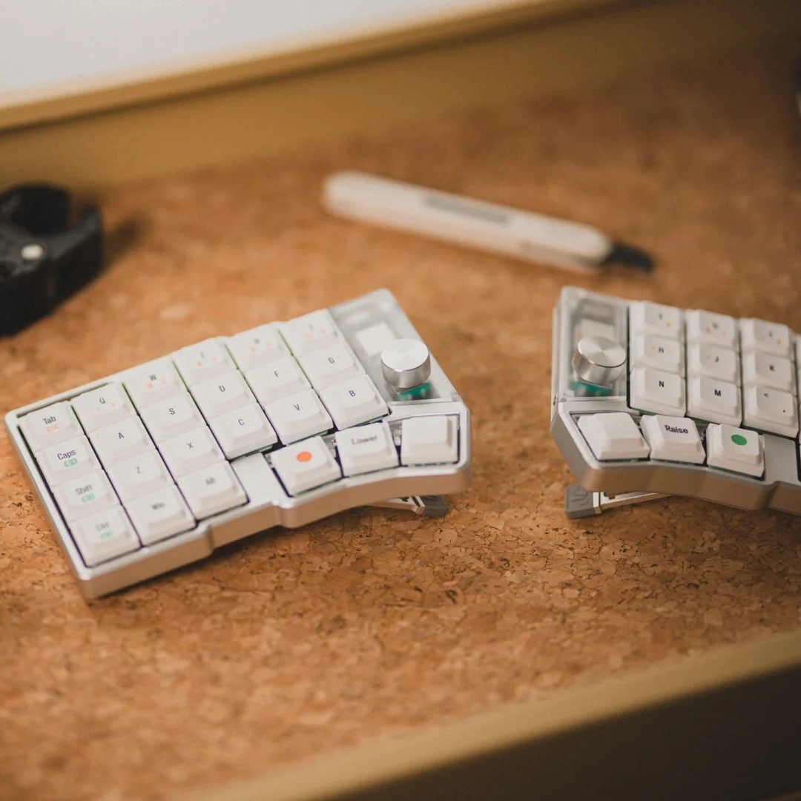

# Dotfiles

Omarchy (Arch + Hyprland) · Neovim · Neovide · tmux · Cornix LP keyboard



| Doc | |
|---|---|
| [Keybindings](docs/keybindings.md) | Hyprland, tmux, Neovim, Neovide, IntelliJ |
| [Keyboard](docs/keyboard-cornix.md) | Cornix LP layers, knobs, combos |
| [IdeaVim](docs/ideavim.md) | IdeaVim keys and IntelliJ settings |

## What's here

| Folder | Goes to |
|---|---|
| `hypr/` | `~/.config/hypr/` |
| `omarchy/` | `~/.config/omarchy/` |
| `nvim/` | `~/.config/nvim/` |
| `neovide/` | `~/.config/neovide/` |
| `tmux/` | `~/.config/tmux/` |
| `ghostty/`, `kitty/` | `~/.config/ghostty/`, `~/.config/kitty/` |
| `starship*.toml` | `~/.config/` |
| `bin/` | `~/.local/bin/` |
| `ideavim/ideavimrc` | `~/.ideavimrc` (IntelliJ) |
| `keyboard/cornix/*.vil` | Vial |

## Setup

**1. Copy configs**

```bash
cd ~/Projects/dotfiles
cp hypr/* ~/.config/hypr/
cp -r omarchy/* ~/.config/omarchy/
rsync -a nvim/ ~/.config/nvim/
cp neovide/config.toml ~/.config/neovide/
cp -r tmux/tmux.conf tmux/scripts ~/.config/tmux/
cp ghostty/config ~/.config/ghostty/
cp kitty/kitty.conf ~/.config/kitty/
cp starship*.toml ~/.config/
install -m 755 bin/tmux-sessionizer ~/.local/bin/
cp ideavim/ideavimrc ~/.ideavimrc
```

**2. Install plugins**

```bash
# Hyprland: per-monitor workspaces (branch must match your Hyprland version)
git clone -b release/0.56.x https://github.com/zjeffer/split-monitor-workspaces ~/.config/hypr/plugins/split-monitor-workspaces

# Bar: lock screen
git clone https://github.com/SirJul1337/omarchy-lock-explorer.git ~/.config/omarchy/plugins/io.github.sirjul1337.lock-explorer

# tmux: plugin manager (then press prefix + I inside tmux)
git clone https://github.com/tmux-plugins/tpm ~/.config/tmux/plugins/tpm
```

**3. Keyboard**: Vial → File → Load saved layout → `keyboard/cornix/mycurrent-cornix.vil`

**4. Reload**

| What | Command |
|---|---|
| Hyprland | `hyprctl reload` |
| Bar | `omarchy restart shell` |
| Terminals | `omarchy restart terminal` |
| tmux | `prefix r` |
| Neovim | restart |

**5. Fix by hand**: lock-screen avatar path in `omarchy/shell.json`

## Update from live configs

```bash
cd ~/Projects/dotfiles
cp ~/.config/hypr/{hyprland,bindings,input,looknfeel,monitors,autostart,split-monitor-workspaces}.lua ~/.config/hypr/{hyprsunset,xdph}.conf hypr/
cp ~/.config/omarchy/shell.{json,toml} omarchy/
cp -r ~/.config/omarchy/plugins/mlue.workspaces omarchy/plugins/
cp ~/.config/omarchy/hooks/theme-set.d/tmux-colors omarchy/hooks/theme-set.d/
rsync -a --delete --exclude .git --exclude .claude --exclude '*.bak*' ~/.config/nvim/ nvim/
cp ~/.config/neovide/config.toml neovide/
cp -r ~/.config/tmux/tmux.conf ~/.config/tmux/scripts tmux/
cp ~/.config/ghostty/config ghostty/
cp ~/.config/kitty/kitty.conf kitty/
cp ~/.config/starship.toml ~/.config/starship-nvim.toml .
sed -E 's| ~/Documents/tsc/[^ ]+||g' ~/.local/bin/tmux-sessionizer > bin/tmux-sessionizer   # drops private project folders
cp ~/Documents/cornix/mycurrent-cornix.vil keyboard/cornix/
cp ~/.ideavimrc ideavim/ideavimrc
python3 ideavim/ideavim2md.py ~/.ideavimrc > docs/ideavim.md   # IdeaVim key notes
python3 keyboard/cornix/vil2md.py keyboard/cornix/mycurrent-cornix.vil   # paste over the layer tables in docs/keyboard-cornix.md
python3 strip-comments.py   # repo copies are kept without comments
```
